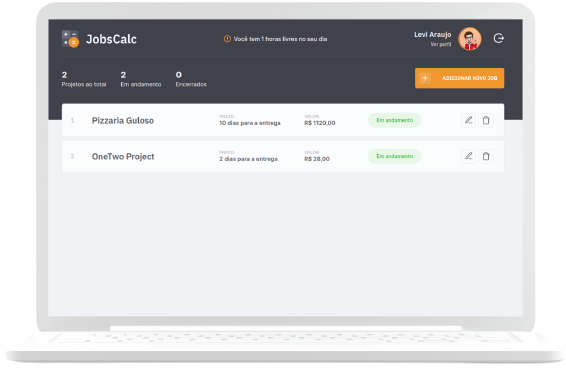

## <center> </center>
---
<div align="center">
  <h3>
    <a href="">
      Projeto
    </a>
	<span> | </span>
    <a href="https://frontend-mentor-rock-paper-scissors-chi.vercel.app">
      WEB
    </a>
  </h3>
</div>


<div style="display:flex;  justify-content: center; align-items: center; margin-top:30px;">
    
    
</div>

## Sumario

- [Sumario](#sumario)
- [Descrição](#pushpin-descrição)
- [Requisitos](#page_facing_up-requisitos)
- [Tecnologias](#robot-tecnologias)
- [Instalação & Execução](#rocket-instalação-execução)
- [Autor](#autor)
- [Licença](#pencil-licença)

## :pushpin: Descrição
 <p>O Jobs Calc é uma aplicação moderna que permite que você possa calcular o custo e prazo dos seus projetos. A aplicação permite que o usuário interaja com seus projetos e monitore os prazos.
 </p>

---

## :page_facing_up: Requisitos
+ Node  _&nbsp;_ &GreaterEqual; _&nbsp;_ 15.11..0
+ npm _&nbsp;_ _&nbsp;_   &GreaterEqual; _&nbsp;_  6.14.11
+ Docker

---
## :robot: Tecnologias
Esse projeto foi desenvolvido com as seguintes tecnologias:
+ HTML & CSS
+ JavaScript
+ Node 
+ PostgreSql 
--- 

## :rocket: Instalação & Execução
Para execução do projeto existem duas formas. A primeira é utilizando o docker para geração de todo ambiente e configuração.
Basta fazer download do projeto no github.
```bash
> git clone https://github.com/levi5/electron-file-manager.git
```
em seguida execute o comando do docker no terminal:
```bash
>  docker-compose up -b --build
```
A segunda forma necessita o download do Node e do banco de dados PostgreSql, além de toda configuração de conexões no arquivo .env.  
Após o download do projeto dentro da pasta execute o seguinte comando no terminal:

```bash
>  npm install
```
O próximo comando irá instalar todas dependências do projeto, mas não o banco de dados. Com o banco de dados instalado e configurado execute o próximo comando:

```bash
>  npm run start
```


## Autor
👤 <strong> Levi Araújo </strong>

---

## :pencil: Licença
Projeto está sob a licença MIT. Veja o arquivo [LICENSE](.github/LICENSE.md) para mais detalhes.

---
Desenvolvido por Levi Araújo